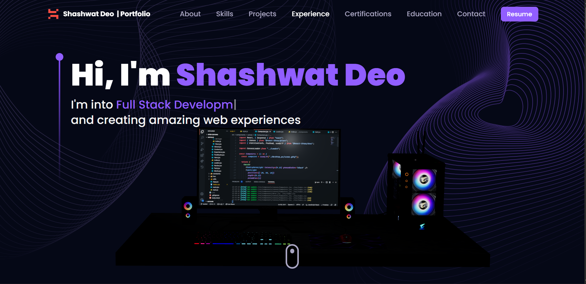

# Shashwat Deo - Full Stack Developer Portfolio



## 🚀 Live Demo

Visit the live portfolio: **[Shashwat Deo Portfolio](https://shashwattx.vercel.app/)**

## 📋 Overview

A modern, responsive portfolio website showcasing my skills as a Full Stack Developer. Built with React.js, Three.js, and Tailwind CSS, featuring smooth animations, 3D graphics, and an interactive user experience.

## ✨ Features

- **Responsive Design**: Optimized for desktop, tablet, and mobile devices
- **3D Graphics**: Interactive 3D desktop model with mouse controls
- **Smooth Animations**: Framer Motion animations throughout the site
- **Modern UI/UX**: Clean, professional design with dark theme
- **Interactive Elements**: Hover effects, transitions, and micro-interactions
- **Performance Optimized**: Fast loading and smooth performance
- **SEO Friendly**: Proper meta tags and semantic HTML structure

## 🛠️ Technologies Used

### Frontend
- **React.js** - Modern JavaScript library for building user interfaces
- **Three.js** - 3D graphics library for web applications
- **Framer Motion** - Animation library for React
- **Tailwind CSS** - Utility-first CSS framework
- **React Three Fiber** - React renderer for Three.js
- **React Router** - Declarative routing for React

### Build Tools & Development
- **Vite** - Fast build tool and development server
- **ESLint** - JavaScript linting utility
- **Prettier** - Code formatter

### Assets & Styling
- **React Icons** - Icon library for React
- **Custom CSS** - Additional styling and animations
- **Responsive Images** - Optimized for different screen sizes

## 🚀 Getting Started

### Prerequisites

- Node.js (version 16 or higher)
- npm or yarn package manager

### Installation

1. **Clone the repository**
   ```bash
   git clone https://github.com/Shashwatdeo/react-portfolio.git
   cd react-portfolio
   ```

2. **Install dependencies**
   ```bash
   npm install
   # or
   yarn install
   ```

3. **Start the development server**
   ```bash
   npm run dev
   # or
   yarn dev
   ```

4. **Open your browser**

   Navigate to `http://localhost:5173` to view the application.

### Build for Production

```bash
npm run build
# or
yarn build
```

The build artifacts will be stored in the `dist/` directory.

## 📱 Responsive Design

The portfolio is fully responsive and optimized for:

- **Desktop** (1200px and above)
- **Tablet** (768px - 1199px)
- **Mobile** (320px - 767px)

## 🎨 Color Palette

- **Primary**: `#915EFF` (Purple accent color)
- **Secondary**: `#F2F3FF` (Light gray for text)
- **Background**: `#0A0A0A` (Dark background)
- **Cards**: `#1D1836` (Card backgrounds)

## 📂 Project Structure

```
src/
├── assets/          # Images, icons, and other static assets
├── components/      # React components
│   ├── canvas/      # 3D graphics components
│   ├── hoc/         # Higher-order components
│   └── ...
├── constants/       # Configuration constants
├── styles/          # Global styles
├── utils/           # Utility functions
└── App.jsx          # Main application component
```

## 🎯 Key Sections

### Hero Section
- Animated typing text
- 3D desktop model with interactive controls
- Smooth entrance animations
- Responsive layout

### About Section
- Personal introduction
- Service cards with hover effects
- Staggered animations

### Skills Section
- Technology icons with floating animations
- Interactive hover effects
- Organized skill categories

### Projects Section
- Project showcase with detailed descriptions
- GitHub links and live demos
- Card hover animations

### Experience Section
- Timeline-based experience display
- Company information and achievements

### Contact Section
- Contact form
- Social media links
- Animated background

## 🚀 Performance Features

- **Lazy Loading**: Components load as needed
- **Image Optimization**: Compressed and properly sized images
- **Code Splitting**: Optimized bundle sizes
- **Smooth Animations**: 60fps animations using CSS transforms
- **Mobile Optimization**: Touch-friendly interactions

## 📸 Screenshots

### Desktop View


### Mobile View
*Mobile screenshots will be added soon*

## 🤝 Contributing

1. Fork the project
2. Create your feature branch (`git checkout -b feature/AmazingFeature`)
3. Commit your changes (`git commit -m 'Add some AmazingFeature'`)
4. Push to the branch (`git push origin feature/AmazingFeature`)
5. Open a Pull Request

## 📄 License

This project is licensed under the MIT License - see the [LICENSE](LICENSE) file for details.

## 👤 Author

**Shashwat Deo**
- Website: [Portfolio](https://shashwat-deo-portfolio.netlify.app)
- LinkedIn: [Shashwat Deo](https://linkedin.com/in/shashwat-deo)
- GitHub: [Shashwatdeo](https://github.com/Shashwatdeo)
- Email: shashwat.deo@email.com

## 🙏 Acknowledgments

- Three.js for the amazing 3D graphics library
- Framer Motion for smooth animations
- React community for excellent documentation
- All the open-source libraries used in this project

---

⭐ If you found this project helpful, please give it a star!

[Back to top](#shashwat-deo---full-stack-developer-portfolio)
